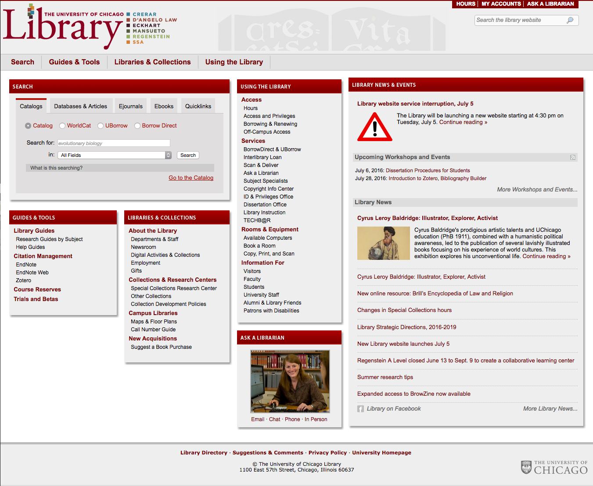

# LibPattern
Directory of mock-ups for the UChicago Library website redesign that occurred in 2017. Mocks created by [Kathy Zadrozny](https://github.com/kzadrozny.

## Live Mocks
Live mocks can be viewed at [uchicago-library.github.io/LibPattern](https://uchicago-library.github.io/LibPattern/)

## Design Results
### Before

### After

## Making Changes
### Working and Editing Files
* Edit the gh-pages branch only.
* Install the required npm pages with `npm install`
* Run task manager with `gulp`

### Local Host
Task manager auto runs port3000 when the gulp command is initiated. All changes are auto refreshed in your local host.
